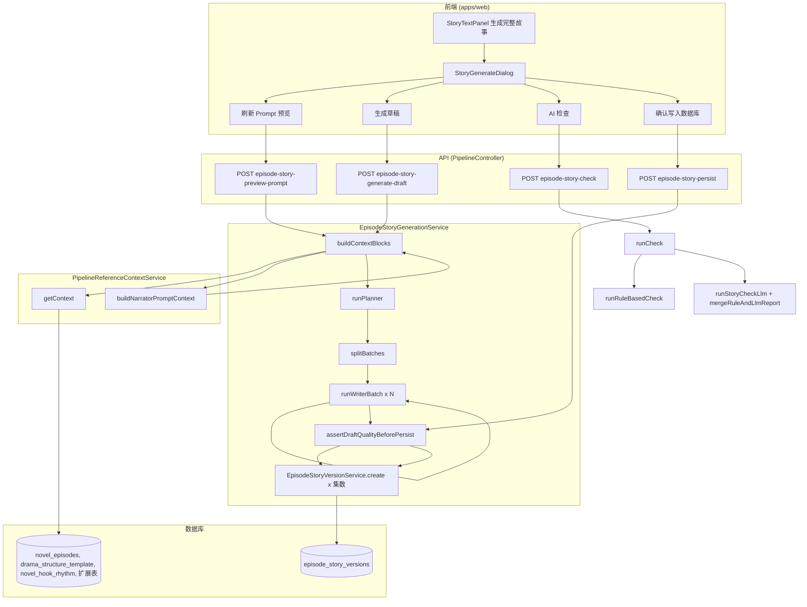

# Episode Story 生成链路审计与爆款短剧重构蓝图

**审计对象**：`episode_story_versions.story_text` 的生成链路  
**目标**：摸清当前如何生成、为何达不到 60 秒/90 秒可拍要求，并给出证据驱动审计 + 重构方案。  
**约定**：只读分析，不直接改代码。

---

# A. 当前生成链路全景图

## 1. 文字描述

- **前端入口**：`StoryTextPanel`（`apps/web/src/components/story-text/StoryTextPanel.tsx`）中按钮「生成完整故事」打开 `StoryGenerateDialog`；用户可先「刷新 Prompt 预览」、再「生成草稿」、可选「AI 检查」、最后「确认写入数据库」。
- **API 路由**：全部走 `PipelineController`（`apps/api/src/pipeline/pipeline.controller.ts`）：
  - `POST /pipeline/:novelId/episode-story-preview-prompt` → `previewPrompt`
  - `POST /pipeline/:novelId/episode-story-generate-draft` → `generateDraft`
  - `POST /pipeline/:novelId/episode-story-check` → `check`
  - `POST /pipeline/:novelId/episode-story-persist` → `persistDraft`
- **写库**：`persistDraft` 通过 `EpisodeStoryVersionService.create()` 逐集写入 `episode_story_versions`，字段包括 `story_text`、`title`、`summary` 等；**当前 persist 不写入 `story_beat_json`**（create 时未从 draft 传 `storyBeatJson`）。
- **生成核心**：`EpisodeStoryGenerationService`（`apps/api/src/pipeline/episode-story-generation.service.ts`）内 **单 service 串行多阶段 LLM 调用**：
  1. **buildContextBlocks**：拉取参考表 → 拼 `promptPreview`（核心三表 JSON + 扩展参考 block + 用户指令）。
  2. **runPlanner**：一次 LLM 调用，输入 `promptPreview`，输出全集的 `episodeNumber, title, summary, storyBeat`（轻量规划）。
  3. **splitBatches**：按 `batchSize`（默认 5）把 plan 切成多批。
  4. **runWriterBatch**：每批一次 LLM 调用，输入「上一批最后一集摘要 + 本批规划 + 参考上下文节选」+ ending guard（若含 55–61 集），输出本批每集的 `episodeNumber, title, summary, storyText`。
  5. **合并**：各批 `storyText` 合并为 `EpisodeStoryDraft.episodes`，并做 `evaluateStoryTextForShortDrama` 仅产生 warnings，不阻断。
  6. **persist**：用户点击写入时调用 `assertDraftQualityBeforePersist`（硬门槛），通过后逐条 `storyVersionService.create(..., storyText)`。

**结论**：**不是多代理系统**。是 **单 Service 内「Planner 一次 + Writer 多批」的串行两阶段 LLM 管线**；无独立「素材筛证」「可拍性 QA 代理」「重写代理」等角色，QA 的 `check` 与 `persist` 解耦，**QA 不通过也不会阻止写入**（仅规则门禁在 persist 内）。

## 2. Mermaid 流程图



**关键字段与函数**：

| 步骤 | 输入 | 输出 | 关键函数/字段 |
|------|------|------|----------------|
| 预览 | novelId, EpisodeStoryPreviewDto (referenceTables, targetEpisodeCount, userInstruction, sourceTextCharBudget 等) | promptPreview, referenceSummary | `buildContextBlocks` → `getContext` + `buildNarratorPromptContext` |
| 生成 | novelId, EpisodeStoryGenerateDraftDto (同上 + batchSize) | draftId, draft.episodes[].storyText | `runPlanner` → `splitBatches` → `runWriterBatch` 循环 |
| 检查 | draftId 或 draft 或 versionIds, referenceTables | overallScore, episodeIssues, suggestions | `runCheck` → `runRuleBasedCheck` + `runStoryCheckLlm` → `mergeRuleAndLlmReport` |
| 写入 | draftId 或 draft | ok, summary | `resolveDraftForPersist` → `assertDraftQualityBeforePersist` → `storyVersionService.create`；每条 create 写入 `story_text` |

---

# B. 代码证据定位

## 1. buildContextBlocks 如何拼上下文

- **文件**：`apps/api/src/pipeline/episode-story-generation.service.ts`，约 593–623 行。
- **逻辑**：
  - 调用 `this.refContext.getContext(novelId, { requestedTables, startEpisode: 1, endEpisode: targetEpisodeCount, optionalTablesCharBudget, overallCharBudget })` 得到 `context`（核心三表：episodes, structureTemplates, hookRhythms；扩展表在 optionalTables）。
  - `buildNarratorPromptContext(context, { charBudget })` 只拼 **optionalTables**（扩展表）为一块字符串 `block`。
  - 核心三表**不**经 buildNarratorPromptContext，而是直接 JSON.stringify 放进 promptPreview：
    - `context.episodes?.slice(0, 200)`
    - `context.structureTemplates?.slice(0, 50)`
    - `context.hookRhythms?.slice(0, 200)`
  - 最终 `promptPreview` 字符串格式为：
    - `【核心参考】\nnovel_episodes:\n${episodesText}\n\ndrama_structure_template:\n${structureText}\n\nnovel_hook_rhythm:\n${hookText}\n\n【扩展参考】\n${block}\n\n${userInstruction ? '用户要求：...' : ''}`

**证据摘要**（619–622 行）：

```typescript
const episodesText = JSON.stringify(context.episodes?.slice(0, 200) ?? [], null, 2);
const structureText = JSON.stringify(context.structureTemplates?.slice(0, 50) ?? [], null, 2);
const hookText = JSON.stringify(context.hookRhythms?.slice(0, 200) ?? [], null, 2);
const promptPreview = `【核心参考】\nnovel_episodes:\n${episodesText}\n\ndrama_structure_template:\n${structureText}\n\nnovel_hook_rhythm:\n${hookText}\n\n【扩展参考】\n${block}\n\n${userInstruction ? `用户要求：${userInstruction}` : ''}`;
```

扩展表来自 `pipeline-reference-context.service.ts` 的 `EXTENDED_TABLE_CONFIG` 与 `getContext` 中按 `requestedTables` 和 `optionalTablesCharBudget` 填充 `optionalTables`，再经 `buildNarratorPromptContext` 按表名拼成 `【label（tableName）】\n${JSON.stringify(rows)}`，单字段过长会截断（如 369 行 `maxPerRow`）。

---

## 2. Planner prompt 原文做什么

- **文件**：`episode-story-generation.service.ts`，`runPlanner` 内约 645–649 行。
- **System**：`你是短剧故事规划助手。根据提供的参考数据，输出每集的轻量规划（episodeNumber、title、summary、storyBeat）。只输出严格 JSON 数组，不要 markdown 和解释。`
- **User**：`请为以下短剧生成 ${targetCount} 集的规划（每集含 episodeNumber、title、summary、storyBeat）。\n\n${contextPreview.slice(0, 40000)}`

**含义**：Planner 只做「轻量规划」，输出的是 **title/summary/storyBeat** 文本字段，**没有** 60s/90s 节拍、没有「3 秒钩子 / 15 秒冲突 / 中段反转 / 尾钩」等时序结构，也没有「单集单目标 / 对抗关系 / 可拍动作」等硬约束描述。

---

## 3. Writer prompt 原文做什么

- **文件**：同上，`runWriterBatch` 内约 726–734 行。
- **System**（节选）：
  - 根据本批每集的规划（title、summary、storyBeat），生成每集的 storyText。
  - 【必须遵守】1）第一人称（沈照「我」、禁止第三人称简介/百科式）。2）结尾优先事件钩子，问句钩子次之，禁止仅抽象词收尾。3）rewrite_goal（建文守江山、朱棣不夺位）。4）若本批含 55–61 集则追加 `buildEndingGuardInstruction` 的终局锁死文案。
  - 只输出严格 JSON 数组，每项含 episodeNumber、title、summary、storyText。

**User**（约 481 行）：`上一批最后一集摘要：${prevSummary || '（无）'}\n\n本批规划：\n${batchPlan}\n\n参考上下文（节选）：\n${contextBlock.slice(0, 30000)}\n\n${userInstruction ? ...}`

**含义**：Writer 的约束全是**软提示**（「必须」「禁止」在自然语里），没有「每集 260 字以上」「前 3 句内出现钩子」「中段必须有一次反转」等可校验的硬指标；且**没有时长/秒数/节拍结构**输入，模型不知道要写 60 秒还是 90 秒可拍体量。

---

## 4. QA prompt 原文做什么

- **文件**：同上，`buildStoryCheckPrompt` 约 991–999 行，`runStoryCheckLlm` 约 1003–1024 行。
- **System**：`你是短剧故事 QA 助手。根据核心三表与扩展参考表，检查故事草稿的提纲一致性、结构节奏、人物设定、连续性、尾钩与可读性。只输出指定 JSON，不要其他内容。`
- **User**：待检查草稿摘要（每集 title/summary/story 前 350 字）+ 核心参考节选（episodes/structure/hook）+ 扩展参考 block，然后要求输出 JSON：`overallScore, episodeIssues[], suggestions[]`。

**含义**：QA 是「检查 + 建议」型，**不返回 pass/fail 阻断**；且与 persist 解耦，**即使 check 返回 passed: false 或 low score，前端仍可点击写入**，只有 `assertDraftQualityBeforePersist` 会拦。

---

## 5. Persist 前有哪些硬门槛

- **文件**：同上，`assertDraftQualityBeforePersist` 约 468–558 行。
- **硬门槛**：
  1. **P0**：episodeNumber 有效；storyText 为 string；trim 后长度 ≥ `MIN_STORY_TEXT_LENGTH`（50）；非占位串 `PLACEHOLDER_STORY_TEXT_TEMPLATE(epNum)`。
  2. **55+ 集终局**：`evaluateEndingGuardForRewriteGoal` 违规（如朱棣攻破南京、建文朝覆灭等）→ 抛错。
  3. **第一人称**：前 120 字「我」0 次且「沈照/她」≥2 → 拦；前 200 字「沈照/她」≥2 且「我」0 → 拦。
  4. **口播字数**：`ev.tooShortForNarration`（charCount < 260）→ 拦。
  5. **事件密度**：`ev.eventDensitySeverelyLow`（动作事件 0 且心理摘要句 ≥4）→ 拦。
  6. **59–61 集终局收束**：`episodeNumber >= 59 && ev.endingClosureMissing` → 拦。

**未在 persist 中拦截的**：弱钩子、仅问句钩子、模板句重复、260–360 字「偏短」、eventDensityLow 非 severe、非 59–61 的 endingClosureWeak 等，仅停留在 warnings/日志。

---

## 6. 哪些 fallback 会把低质量内容放行

- **Writer 批失败**：若某批 `runWriterBatch` 抛错（如返回空、条数不足、invalid storyText 条数>0），整个 generateDraft 失败，无 fallback 写库。
- **Persist**：只要通过 `assertDraftQualityBeforePersist`，即逐条 create；**没有**「QA 不通过则禁止 persist」逻辑，也没有「低于某分则拒绝」。
- **Planner 条数**：若 `arr.length !== targetCount` 直接抛错，不补齐不截断，无 fallback。
- **Draft 内容**：合并各批后只做 `evaluateStoryTextForShortDrama` 推 warnings，**不阻断**；因此「弱钩子、摘要味重、衔接差但字数/第一人称/终局/事件密度未触线」的 storyText 仍可进入缓存草稿并在用户点击时写入。

---

# C. 当前设计为什么生成不出爆款 AI 短剧

## 1. 参考数据问题

- **进入方式**：核心三表（novel_episodes, drama_structure_template, novel_hook_rhythm）以整表 JSON 切片进入「核心参考」；扩展表（set_core, payoff, opponents, story_phases, novel_characters, key_nodes, timelines, drama_source_text 等）进「扩展参考」块，受 `optionalTablesCharBudget` 和 per-row 截断限制。
- **浪费点**：
  - **没有「戏剧证据包」**：原始史料/结构表/hook 表/payoff 表是「原始记录」直接 JSON 塞进 prompt，未做「与本集强相关」的筛选与归纳，writer 看到的是一大段多表混合文本，难以聚焦「本集要用的冲突、对手、爽点、钩子」。
  - **hook_rhythm** 虽有 episode_number，但 prompt 里与 novel_episodes、structure 并列平铺，writer 未被要求「必须实现 hook_rhythm 中本集 hook_type/description/cliffhanger」。
  - **set_payoff_lines / set_story_phases** 等带 start_ep/end_ep 的结构，没有在 planner 或 writer 阶段被显式「按集对齐」使用，只是作为通用参考。
  - **drama_source_text / novel_source_segments** 若被选入，是按字符预算截断的整块，未按「当前集对应的时间线/章节」做切片，可拍细节难以精准进入本集。

## 2. 任务定义问题

- **当前产出**：Planner 产出的是「每集 title + summary + storyBeat」的**连续叙述型规划**；Writer 在此基础上写「故事正文」storyText，**没有**明确「单集 = 60 秒或 90 秒可拍故事单元」的定义。
- **缺失**：没有「节拍/时长」目标（如开篇 3 秒钩子、15 秒内冲突、中段反转、尾钩），没有「单集单核心目标」「明确对抗关系」「可视化动作而非纯说明」等任务描述，导致模型默认写成「剧情摘要/连续叙述」而非「可拍短剧单元」。

## 3. 约束缺失问题（未成硬门槛）

- 以下在 prompt 中至多为软提示或未出现，且**未全部**在 persist 门禁中落实：
  - **3 秒内钩子**：未要求，未校验。
  - **15 秒内冲突升级**：未要求，未校验。
  - **中段反转**：仅依赖 storyBeat 自由文本，无结构校验。
  - **尾钩**：有事件钩子/问句钩子/弱钩子的评估与 warning，但仅「严重弱钩子」未单独拦 persist；concrete/event hook 为软提示。
  - **单集单核心目标**：未要求。
  - **明确对抗关系**：未在 writer 中强调，未校验。
  - **可视化动作**：有 ACTION_EVENT_PATTERNS 等做事件密度，但无「场景数/角色数/镜头可拍性」等硬门槛。

## 4. 连续性问题

- **Batch 间衔接**：仅靠 `prevSummary`（上一批最后一集的 summary 或 storyText 前 200 字）传入下一批 writer；**没有**上一批最后一集的**完整 storyText 尾段**或「下一集开篇约束」。
- **后果**：下一批 writer 只知道「上一集大概讲了什么」，不知道上一集**结尾具体画面/台词**，容易衔接生硬或重复感强；且 summary 本身偏摘要体，不利于「镜头级」连贯。

## 5. QA 问题

- **Rule-based QA**（`runRuleBasedCheck`）：只查「缺少正文」「正文过短 &lt;50」，分数 80 起扣，**过弱**，无法识别摘要味、无钩子、无反转等。
- **LLM QA**：只做「检查 + 建议」，返回 episodeIssues 和 suggestions；**不参与 persist 决策**，persist 不读 check 结果，因此**无法「卡死重写」**，低分草稿仍可被用户点写入。

## 6. 落库问题

- **仍可能写进 episode_story_versions 的低质量**：在通过现有硬门槛的前提下，以下仍可落库：
  - 字数在 260–360 之间、偏摘要的正文；
  - 结尾仅问句钩子、无事件钩子；
  - 弱钩子（有具体实体但尾句仍偏空泛）；
  - 模板句重复多但未达「严重」事件密度或终局问题；
  - 非 59–61 集的终局段「仍开环」；
  - 中段无明确反转、单集目标不清晰、对抗关系模糊的叙述。

---

# D. 用现有表设计，怎样改成「爆款短剧生成链」

在不推翻现有 DB 的前提下，用现有表设计一个 5 阶段方案：

| 阶段 | 名称 | 输入表/数据 | 输出结构 | 备注 |
|------|------|-------------|----------|------|
| 1 | 素材筛证代理 | novel_episodes, drama_source_text, novel_source_segments, novel_timelines, novel_key_nodes, novel_explosions, novel_skeleton_*, set_core, set_opponents, set_payoff_*, set_story_phases, novel_hook_rhythm | 按集或按段的「戏剧证据包」：本集相关史料摘要、人物、对手、爽点线、阶段、钩子要求等 | 可新增加工结果缓存表或 JSON 字段（如 novel_episodes 的 evidence_pack_json），或仅在内存/LLM 输入中体现 |
| 2 | 单集 Beat 规划代理 | 证据包 + 上集尾 beat（若有） | 每集 60s/90s 节拍：hook_3s, conflict_15s, mid_reversal, climax, tail_hook, single_goal, antagonist | 可复用/扩展 episode_story_versions.story_beat_json 的 schema，或 planner 输出新 DTO 写入临时结构 |
| 3 | 可拍故事代理 | 本集 beat + 证据包 + 上集尾句/尾 beat | storyText，且满足「时长结构」约束（字数/节奏与 60s/90s 对应） | Writer 输入从「title/summary/storyBeat」升级为「beat 规划 + 证据包」 |
| 4 | 导演可拍性 QA 代理 | storyText + beat + 硬标准 | pass/fail + 不通过项列表；不通过则**禁止 persist** | 与 persist 耦合：只有 QA pass 才允许写入 |
| 5 | 自动重写代理 | 不通过项 + 原 storyText + beat | 修订后的 storyText，再回阶段 4 | 可选；可限制重试次数 |

- **是否新增 JSON/中间表**：建议 **planner 输出** 写入「beat 规划」结构，可存 `episode_story_versions.story_beat_json`（当前 persist 未写，可改为写入）；若需缓存「证据包」，可新增 `novel_episodes.evidence_pack_json` 或单独小表。
- **story_beat_json**：可继续复用并扩展为 60s/90s 节拍结构（hook_3s, conflict_15s, mid_reversal, tail_hook 等），由阶段 2 产出、阶段 3 消费、阶段 4 校验。

---

# E. 最小改造方案（MVP）

只做最小改动，把 story_text 从「摘要体」拉向「可拍短剧体」：

1. **必改 prompt 点**
   - Planner：明确「每集输出为 60 秒/90 秒可拍单元」，增加「单集单核心目标、结尾必须事件钩子」的规划要求；输出中 storyBeat 改为结构化字段（或保留 storyBeat 但要求内含「开钩/冲突/反转/尾钩」关键词）。
   - Writer：在 system 中显式写「本集目标时长约 60 秒/90 秒口播（约 xxx 字）」「前 3 句内要有钩子」「中段需有一次明确反转」「结尾必须是已发生或即将发生的事件钩子」，并保留现有第一人称/rewrite_goal/ending guard。

2. **必改硬门槛**
   - Persist：在现有基础上，对「弱钩子」或「仅问句钩子」做可选硬拦（例如 59–61 不拦，其余集若 severeWeakHook 或 questionHookOnly 则拦）；或至少将 MIN_NARRATION_CHARS_WEAK（360）设为 persist 下限（当前只拦 &lt;260）。

3. **必改 QA 规则**
   - runRuleBasedCheck：增加「事件密度低」「尾钩过弱」等规则项并扣分；或与 evaluateStoryTextForShortDrama 对齐，把其中若干项纳入 rule 分数。
   - 在 persist 前**强制调用一次 check**（或复用 assertDraftQualityBeforePersist 的评估），若 overallScore &lt; 60 或存在 high severity 且未修复，则拒绝写入（可选 MVP：仅做 score 门槛）。

4. **必改 batch continuity**
   - 传入 writer 的 `prevSummary` 改为「上一批最后一集的**最后 150–200 字 storyText**」+ 可选 summary，使下一批在「结尾画面/台词」层面衔接。

5. **必改参考表筛选方式**
   - 按集过滤：对 novel_hook_rhythm、set_payoff_lines、set_story_phases 等带 start_ep/end_ep 的表，在 buildContextBlocks 或 getContext 时按「当前 batch 的 episode 范围」只取相关行，减少噪音；对 writer 每批可只附「本批集数相关的参考」而不是全集。

---

# F. 推荐重构方案（更优）

- **中间结构 DTO / JSON schema**：定义 60s/90s 的 beat schema（hook_3s, conflict_15s, mid_reversal, climax, tail_hook, single_goal），planner 输出该结构，写入 `story_beat_json` 或中间表。
- **Planner 改为 Beat Planner**：输出从「title/summary/storyBeat」改为「title + summary + beat 结构」，并约束「单集单目标、明确对手、尾钩类型」。
- **Writer 改为 Scene/Beat Constrained Writer**：输入为「本集 beat + 本集证据包 + 上集尾段」，输出 storyText 必须覆盖 beat 各节点，并在 prompt 中写明字数区间（如 60s≈280–350 字）。
- **QA 不通过则禁止 persist**：persist 前必须调用 QA（或内联同一套硬标准），QA 返回不通过时直接 BadRequest，不写库；可选「自动重写一次」再 QA。
- **Shot-aware 生成（后续）**：在 beat 或 storyText 上引入「可拍镜头/动作」的显式描述或校验，便于下游分镜。

---

# G. 直接给最终建议

1. **目前问题主要是哪类？**  
   **三者都有**：  
   - **Prompt 设计**：Planner/Writer 未定义「60s/90s 可拍单元」、无节拍/时长/钩子时序，多为软提示。  
   - **参考表选择与使用**：表多但平铺进 prompt，未做「按集/按段」的戏剧证据包筛选与归纳，writer 难以聚焦。  
   - **链路设计**：单 service 两阶段（planner + writer），无独立素材筛证、无 beat 规划、QA 与 persist 解耦导致低质量仍可落库；batch 间仅 prevSummary 衔接不足。

2. **若只能改 20% 代码，优先改哪 3 件事？**  
   - **Writer 的 prompt**：加入「60 秒/90 秒可拍」「前 3 句钩子、中段反转、结尾事件钩子」及建议字数区间，并保留现有第一人称/终局约束。  
   - **Persist 硬门槛**：把「口播偏短」下限提到 360 字（或配置），并对「严重弱钩子/仅问句钩子」在非终局集做一次硬拦。  
   - **Batch 衔接**：writer 的 prevSummary 改为「上一批最后一集的 storyText 尾 150–200 字」，减少跨批衔接差。

3. **要达到爆款短剧目标，现有表里哪些最该重用、哪些不该直接喂 writer？**  
   - **最该重用并加工**：novel_episodes（本集 outline/opening/core_conflict/hooks/cliffhanger）、novel_hook_rhythm（按集）、set_payoff_lines（按 start_ep/end_ep 筛）、set_story_phases、set_core（rewrite_goal/constraint）、set_opponents、novel_characters；应做成「本集证据包」再给 writer。  
   - **不该直接整表喂 writer**：drama_source_text / novel_source_segments 整块、drama_structure_template 全集、novel_timelines/novel_key_nodes 全集；应先按集/按时间线筛或摘要成「与本集相关的冲突/事件/人物」再进 prompt。

---

# 可直接实施的改造清单

| 优先级 | 项 | 说明 |
|--------|----|------|
| **P0** | Writer prompt 增加 60s/90s 可拍与钩子/反转/尾钩约束 | 在 system 中明确时长目标、前 3 句钩子、中段反转、结尾事件钩子、建议字数区间 |
| **P0** | Persist 口播字数下限改为 360（或可配置） | 当前 260 拦；260–360 仅 warning；改为 360 拦，减少摘要体落库 |
| **P0** | Writer 批间衔接用「上批最后一集 storyText 尾 150–200 字」 | 替换或补充 prevSummary，改善跨批衔接 |
| **P1** | Persist 对「严重弱钩子/仅问句钩子」在非 55–61 集做硬拦 | 在 assertDraftQualityBeforePersist 中增加条件，与 evaluateStoryTextForShortDrama 的 severeWeakHook/questionHookOnly 挂钩 |
| **P1** | 参考表按 batch 集数过滤 | getContext/buildContextBlocks 对 hook_rhythm、payoff_lines、story_phases 等按 start_ep/end_ep 只取本批相关行，writer 每批只附本批相关参考 |
| **P1** | QA 与 persist 耦合：score&lt;60 或 high severity 未修则禁止写入 | 在 persist 流程内调用 check 或同一套规则，不通过则 BadRequest，不写库 |
| **P2** | Planner 输出结构化 beat（可存 story_beat_json） | 定义 beat schema，planner 输出 hook_3s/conflict_15s/mid_reversal/tail_hook 等，writer 消费 beat，persist 写入 story_beat_json |
| **P2** | 素材筛证阶段：按集生成「戏剧证据包」 | 单独方法或服务，从多表按集筛选归纳，再喂给 planner/writer |
| **P2** | 可拍性 QA 代理 + 不通过自动重写一次 | 独立 QA 步骤，不通过则触发一次重写再 QA，再决定是否 persist |

---

*审计依据：apps/api/src/pipeline/episode-story-generation.service.ts、pipeline-reference-context.service.ts、episode-story-version.service.ts、pipeline.controller.ts、dto/episode-story-*.ts；apps/web StoryTextPanel、episode-story-api；sql 迁移与 docs/episode-story-round3-hard-gates-report.md。*
